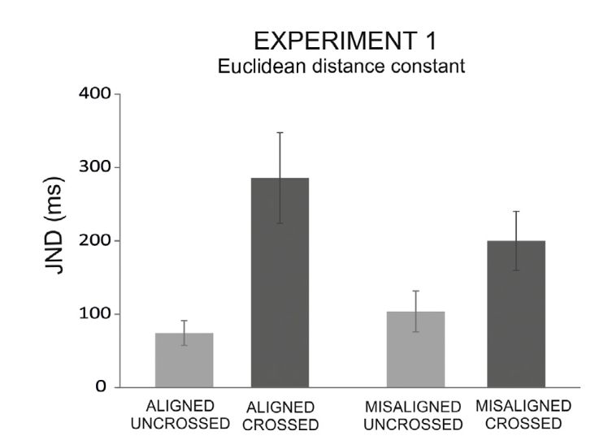

#### Article ID: hJiYk
#### Pilot: Em Reit
#### Co-pilot: Tom Hardwicke  
#### Start date: Mar 12 2017
#### End date: Mar 27 2017
#### Final verification: Tom Hardwicke
#### Date: Nov 9 2017

-------

#### Methods summary: 

Sixteen participants were recruited for Study 1. All participants were right-handed and did not know the purpose of the experiment. Participants either had their arms crossed or uncrossed (*posture*), and aligned (close to each other) or misaligned (far from each other; *alignment*) in the vertical dimension, throughout the study (within-subjects design.)

Tactile stimuli were transmitted to the ring finger of each hand in a random order. Participants had to identify which stimulus was presented first (left or right hand) by pressing a button with the corresponding hand. 

There were two dependent variables, the just-noticeable difference (JND), a measure of precision, and the proportion correct responses (ACC), a measure of accuracy.

In Study 1, participants either had their arms uncrossed and aligned (6 cm apart), crossed and aligned, uncrossed and unaligned (30 cm apart, vertically) or crossed and unaligned. Each of the four conditions were presented twice, with 84 trials within each block.

------

#### Target outcomes: 

The target outcomes are as follows:

> In Experiment 1 we investigated whether information about the location of a touch in the vertical (up-down) dimension could be used to prevent the crossed-hands deficit. We expected that elevating one of the hands would reduce the crossed-hands deficit. A repeated measures ANOVA with the within-subject factors of Posture and Alignment showed that the JND was larger when the arms were crossed as compared to uncrossed (main effect of posture: F(1, 15) = 11.93, p = 0.004, gp2 = 0.44; Fig. 1, left panel), replicating a well-established crossed-hands deficit (Shore et al., 2002; Yamamoto & Kitazawa, 2001). Moreover, the crossed-hands deficit (difference in performance in the two postures) was reduced by a factor of two in the misaligned as compared to the aligned condition (mean crossed-hands deficit: 96.79 and 211.36 ms, respectively) as denoted by the interaction Posture Alignment: F(1,15) = 10.27, p = 0.006, gp2 = 0.41). However, despite this reduction, a reliable crossed-hands deficit emerged in both conditions (planned t-test comparisons – misaligned: t(15) = 2.81, p = 0.01, dz = 0.70; aligned: t(15) = 3.61, p < 0.003, dz = 0.90).

------

```{r global_options, include=FALSE}
knitr::opts_chunk$set(echo=TRUE, warning=FALSE, message=FALSE)

# prepare an empty report object, we will update this each time we run compareValues2()
reportObject <- data.frame("Article_ID" = NA, "valuesChecked" = 0, "eyeballs" = 0, "Total_df" = 0, "Total_p" = 0, "Total_mean" = 0, "Total_sd" = 0, "Total_se" = 0, "Total_ci" = 0, "Total_bf" = 0, "Total_t" = 0, "Total_F" = 0, "Total_es" = 0, "Total_median" = 0, "Total_irr" = 0, "Total_r" = 0, "Total_z" = 0, "Total_coeff" = 0, "Total_n" = 0, "Total_x2" = 0, "Total_other" = 0, "Insufficient_Information_Errors" = 0, "Decision_Errors" = 0, "Major_Numerical_Errors" = 0, "Minor_Numerical_Errors" = 0, "Major_df" = 0, "Major_p" = 0, "Major_mean" = 0, "Major_sd" = 0, "Major_se" = 0, "Major_ci" = 0, "Major_bf" = 0, "Major_t" = 0, "Major_F" = 0, "Major_es" = 0, "Major_median" = 0, "Major_irr" = 0, "Major_r" = 0, "Major_z" = 0, "Major_coeff" = 0, "Major_n" = 0, "Major_x2" = 0, "Major_other" = 0, "affectsConclusion" = NA, "error_typo" = 0, "error_specification" = 0, "error_analysis" = 0, "error_data" = 0, "error_unidentified" = 0, "Author_Assistance" = NA, "resolved_typo" = 0, "resolved_specification" = 0, "resolved_analysis" = 0, "resolved_data" = 0, "correctionSuggested" = NA, "correctionPublished" = NA)
```

## Step 1: Load packages

Some useful packages are being loaded below:

```{r}
library(tidyverse) # for data munging
library(knitr) # for kable table formating
library(haven) # import and export 'SPSS', 'Stata' and 'SAS' Files
library(readxl) # import excel files
library(CODreports) # custom report functions
library(lsr) # for calculating effect sizes
library(afex) # for anova
se <- function(x){ # standard error function
  return(sd(x)/sqrt(length(x)))
}
```


## Step 2: Load data

NB data was manually cleaned to remove NA columns, remove duplicated subjects column, remove summary stats rows, and combine dual header columns.

```{r}
d <- read_csv("data/data_manualClean.csv")
```

## Step 3: Tidy data

```{r}
# make subject column factor
d_tidy <- d %>%
  mutate(subject = factor(subject))

# separate dataframes for each dv (JND, ACC)
d_tidy_JND <- d_tidy %>% select(subject, "Alig_U" = JND_Alig_U, "Alig_C" = JND_Alig_C, "Misalig_U" = JND_Misalig_U, "Misalig_C" = JND_Misali_C)

d_tidy_ACC <- d_tidy %>% select(subject, "Alig_U" = ACC_Alig_U, "Alig_C" = ACC_Alig_C, "Misalig_U" = ACC_Misalig_U, "Misalig_C" = ACC_Misali_C)

d_tidy_JND <- d_tidy_JND %>%
  gather(condition, JND, Alig_U:Misalig_C, factor_key=TRUE) %>%
  separate(condition, c("Alignment", "Posture"), sep = "_", remove=T)

d_tidy_ACC <- d_tidy_ACC %>%
  gather(condition, ACC, Alig_U:Misalig_C, factor_key=TRUE) %>%
  separate(condition, c("Alignment", "Posture"), sep = "_", remove=T)

# combine ACC and JND dataframes
d_tidy <- full_join(d_tidy_JND, d_tidy_ACC) %>%
  mutate(Alignment = factor(Alignment),
         Posture = factor(Posture, levels = c("U", "C")))
```

Data is tidy:
```{r}
d_tidy
```

## Step 4: Run analysis

### Descriptive statistics

This is the main figure we are trying to reproduce:



> Mean just-noticeable difference (JND) in the aligned and misaligned conditions (vertical plane) with crossed and uncrossed limbs. Dark grey bars represent data from the crossed conditions; light grey bars represent data from the uncrossed conditions. Error bars represent standard error of the mean. 

Make a summary table of the descriptives:

```{r}
summaryTable <- d_tidy %>% 
  group_by(Alignment, Posture) %>% 
  summarise(M_JND = mean(JND), SE_JND = se(JND)) %>%
  mutate(condition = paste0(Alignment, "_", Posture),
         condition = factor(condition, levels = c("Alig_U", "Alig_C", "Misalig_U", "Misalig_C")))

kable(summaryTable)
```

Now make the plot:

```{r}
summaryTable %>% ggplot() + geom_bar(aes(x = condition, y = M_JND), stat = "identity") + geom_errorbar(aes(x = condition, ymin = M_JND-SE_JND, ymax = M_JND+SE_JND), width = .1) + theme_minimal() + ylim(0,400)
```

The plots appear to match.

```{r}
# eyeball means
m <- summaryTable %>% filter(condition == 'Alig_U') %>% pull(M_JND)
reportObject <- compareValues2(reportedValue = "eyeballMATCH", obtainedValue = m, valueType = 'mean')

m <- summaryTable %>% filter(condition == 'Alig_C') %>% pull(M_JND)
reportObject <- compareValues2(reportedValue = "eyeballMATCH", obtainedValue = m, valueType = 'mean')

m <- summaryTable %>% filter(condition == 'Misalig_U') %>% pull(M_JND)
reportObject <- compareValues2(reportedValue = "eyeballMATCH", obtainedValue = m, valueType = 'mean')

m <- summaryTable %>% filter(condition == 'Misalig_C') %>% pull(M_JND)
reportObject <- compareValues2(reportedValue = "eyeballMATCH", obtainedValue = m, valueType = 'mean')

# eyeball SEs
se <- summaryTable %>% filter(condition == 'Alig_U') %>% pull(SE_JND)
reportObject <- compareValues2(reportedValue = "eyeballMATCH", obtainedValue = se, valueType = 'se')

se <- summaryTable %>% filter(condition == 'Alig_C') %>% pull(SE_JND)
reportObject <- compareValues2(reportedValue = "eyeballMATCH", obtainedValue = se, valueType = 'se')

se <- summaryTable %>% filter(condition == 'Misalig_U') %>% pull(SE_JND)
reportObject <- compareValues2(reportedValue = "eyeballMATCH", obtainedValue = se, valueType = 'se')

se <- summaryTable %>% filter(condition == 'Misalig_C') %>% pull(SE_JND)
reportObject <- compareValues2(reportedValue = "eyeballMATCH", obtainedValue = se, valueType = 'se')
```
summaryTable


### Inferential statistics

> A repeated measures ANOVA with the within-subject factors of Posture and Alignment showed that the JND was larger when the arms were crossed as compared to uncrossed (main effect of posture: F(1, 15) = 11.93, p = 0.004, gp2 = 0.44)

Here we attempted to reproduce this outcome:

```{r}
mod <- aov_ez(id = "subject", dv = "JND", data = d_tidy, within = c("Posture", "Alignment"), anova_table = list(correction = "none", es = "pes"))
aov <- mod$anova_table
```

```{r}
reportObject <- compareValues2(reportedValue = "1", obtainedValue = aov$`num Df`[1], valueType = 'df') # df1
reportObject <- compareValues2(reportedValue = "15", obtainedValue = aov$`den Df`[1], valueType = 'df') # df2
reportObject <- compareValues2(reportedValue = "11.93", obtainedValue = aov$`F`[1], valueType = 'F') # F
reportObject <- compareValues2(reportedValue = "0.004", obtainedValue = aov$`Pr(>F)`[1], valueType = 'p') # p
reportObject <- compareValues2(reportedValue = "0.44", obtainedValue = aov$`pes`[1], valueType = 'es') # partial eta
```

> This was further demonstrated by a significant interaction of posture * alignment, F(1,15)=10.27, p = .006, gp2 = 0.41).

```{r}
reportObject <- compareValues2(reportedValue = "1", obtainedValue = aov$`num Df`[3], valueType = 'df') # df1
reportObject <- compareValues2(reportedValue = "15", obtainedValue = aov$`den Df`[3], valueType = 'df') # df2
reportObject <- compareValues2(reportedValue = "10.27", obtainedValue = aov$`F`[3], valueType = 'F') # F
reportObject <- compareValues2(reportedValue = "0.006", obtainedValue = aov$`Pr(>F)`[3], valueType = 'p') # p
reportObject <- compareValues2(reportedValue = "0.41", obtainedValue = aov$`pes`[3], valueType = 'es') # partial eta
```

> The cross-hands deficit (difference in performance in the two postures) was  reduced by a factor of two in the misaligned as compared to the aligned condition (97.79 and 211.36, respectively).

Calculate the cross-hands deficit (difference in performance in the two postures):

```{r}
d2 <- d %>% mutate(CHD_misalig = JND_Misali_C - JND_Misalig_U,
             CHD_alig = JND_Alig_C - JND_Alig_U)

misalig_CHD <- mean(d2$CHD_misalig)
alig_CHD <- mean(d2$CHD_alig)

reportObject <- compareValues2(reportedValue = "97.79", obtainedValue = misalig_CHD, valueType = 'mean')
reportObject <- compareValues2(reportedValue = "211.36", obtainedValue = alig_CHD, valueType = 'mean')
```

> However, despite this reduction, a reliable crossed-hands deficit emerged in both conditions (planned t-test comparisons – misaligned: t(15) = 2.81, p = 0.01, dz = 0.70; 

We attempt to reproduce these outcomes below:

```{r}
t.out <- t.test(d2$CHD_misalig, mu = 0)
d.out <- cohensD(d2$CHD_misalig)
```

```{r}
reportObject <- compareValues2(reportedValue = "15", obtainedValue = t.out$parameter, valueType = 'df')
reportObject <- compareValues2(reportedValue = "2.81", obtainedValue = t.out$statistic[[1]], valueType = 't')
reportObject <- compareValues2(reportedValue = "0.01", obtainedValue = t.out$p.value, valueType = 'p')
reportObject <- compareValues2(reportedValue = "0.70", obtainedValue = d.out, valueType = 'es')
```

> aligned: t(15) = 3.61, p < 0.003, dz = 0.90).

```{r}
t.out <- t.test(d2$CHD_alig, mu = 0)
d.out <- cohensD(d2$CHD_alig)
```

```{r}
reportObject <- compareValues2(reportedValue = "15", obtainedValue = t.out$parameter, valueType = 'df')
reportObject <- compareValues2(reportedValue = "3.61", obtainedValue = t.out$statistic[[1]], valueType = 't')
reportObject <- compareValues2(reportedValue = "eyeballMATCH", obtainedValue = t.out$p.value, valueType = 'p')
reportObject <- compareValues2(reportedValue = "0.90", obtainedValue = d.out, valueType = 'es')
```

All values seem to match.

## Step 5: Conclusion

This replication was overall a success. We found only one minor numerical error in the reporting of these results. 

```{r}
reportObject$Article_ID <- "hJiYk"
reportObject$affectsConclusion <- NA
reportObject$error_typo <- 0
reportObject$error_specification <- 0
reportObject$error_analysis <- 0
reportObject$error_data <- 0
reportObject$error_unidentified <- 0
reportObject$Author_Assistance <- F
reportObject$resolved_typo <- 0
reportObject$resolved_specification <- 0
reportObject$resolved_analysis <- 0
reportObject$resolved_data <- 0
reportObject$correctionSuggested <- NA
reportObject$correctionPublished <- NA

# decide on final outcome
if(reportObject$Decision_Errors > 0 | reportObject$Major_Numerical_Errors > 0 | reportObject$Insufficient_Information_Errors > 0){
  reportObject$finalOutcome <- "Failure"
  if(reportObject$Author_Assistance == T){
    reportObject$finalOutcome <- "Failure despite author assistance"
  }
}else{
  reportObject$finalOutcome <- "Success"
  if(reportObject$Author_Assistance == T){
    reportObject$finalOutcome <- "Success with author assistance"
  }
}

# save the report object
filename <- paste0("reportObject_", reportObject$Article_ID,".csv")
write_csv(reportObject, filename)
```

## Report Object

```{r, echo = FALSE}
# display report object in chunks
kable(reportObject[2:10], align = 'l')
kable(reportObject[11:20], align = 'l')
kable(reportObject[21:25], align = 'l')
kable(reportObject[26:30], align = 'l')
kable(reportObject[31:35], align = 'l')
kable(reportObject[36:40], align = 'l')
kable(reportObject[41:45], align = 'l')
kable(reportObject[46:51], align = 'l')
kable(reportObject[52:57], align = 'l')
```

## Session information

```{r session_info, include=TRUE, echo=TRUE, results='markup'}
devtools::session_info()
```
