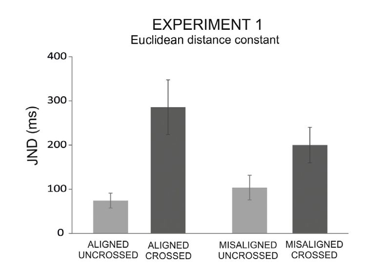

#### Article ID: hJiYk
#### Pilot: Em Reit
#### Co-pilot: Tom Hardwicke  
#### Start date: 03/12/2017
#### End date: 03/17/2017

-------

#### Methods summary: 

Sixteen participants were recruited for Study 1. All participants were right-handed and did not know the purpose of the experiment. Participants either had their arms crossed or uncrossed (*posture*), and aligned (close to each other) or misaligned (far from each other; *alignment*) in the vertical dimension, throughout the study (within-subjects design.)

Tactile stimuli were transmitted to the ring finger of each hand in a random order. Participants had to identify which stimulus was presented first (left or right hand) by pressing a button with the corresponding hand. 

There were two dependent variables, the just-noticeable difference (JND), a measure of precision, and the proportion correct responses (ACC), a measure of accuracy.

In Study 1, participants either had their arms uncrossed and aligned (6 cm apart), crossed and aligned, uncrossed and unaligned (30 cm apart, vertically) or crossed and unaligned. Each of the four conditions were presented twice, with 84 trials within each block.

------

#### Target outcomes: 

The target outcomes are as follows:

1. A repeated measure ANOVA, with within-subject factor of *posture* and *alignment*, showed that the JND in response time was larger when the arms were crossed as compared to uncrossed. There was a main effect of posture F(1,15)=11.93, p = .004.

2. The cross-hands deficit (difference in performance in the two postures) was  reduced by a factor of two in the misaligned as compared to the aligned condition (97.79 and 211.36, respectively). This was further demonstrated by a significant interaction of posture * alignment, F(1,15)=10.27, p = .006.

3. Despite this reduction, a reliable crossed-hands deficit emerged in both posture conditions, a planned t-test comparison showed: misaligned: t(15) = 2.81, p = .01, aligned: t(15) = 3.61, p < .001.

------

```{r global_options, include=FALSE}
knitr::opts_chunk$set(echo=TRUE, warning=FALSE, message=FALSE)
```

## Step 1: Load packages

Some useful packages are being loaded below:

```{r}
library(tidyverse) # for data munging
library(knitr) # for kable table formating
library(haven) # import and export 'SPSS', 'Stata' and 'SAS' Files
library(readxl) # import excel files
library(CODreports) # custom report functions
library(lsr) # for calculating effect sizes
```


## Step 2: Load data

NB data was manually cleaned to remove NA columns, remove duplicated subjects column, remove summary stats rows, and combine dual header columns.

```{r}
d <- read_csv("data/data_manualClean.csv")
```

## Step 3: Tidy data

```{r}
# make subject column factor
d_tidy <- d %>%
  mutate(subject = factor(subject))

# separate dataframes for each dv (JND, ACC)
d_tidy_JND <- d_tidy %>% select(subject, "Alig_U" = JND_Alig_U, "Alig_C" = JND_Alig_C, "Misalig_U" = JND_Misalig_U, "Misalig_C" = JND_Misali_C)

d_tidy_ACC <- d_tidy %>% select(subject, "Alig_U" = ACC_Alig_U, "Alig_C" = ACC_Alig_C, "Misalig_U" = ACC_Misalig_U, "Misalig_C" = ACC_Misali_C)

d_tidy_JND <- d_tidy_JND %>%
  gather(condition, JND, Alig_U:Misalig_C, factor_key=TRUE) %>%
  separate(condition, c("Alignment", "Posture"), sep = "_", remove=T)

d_tidy_ACC <- d_tidy_ACC %>%
  gather(condition, ACC, Alig_U:Misalig_C, factor_key=TRUE) %>%
  separate(condition, c("Alignment", "Posture"), sep = "_", remove=T)

# combine ACC and JND dataframes
d_tidy <- full_join(d_tidy_JND, d_tidy_ACC) %>%
  mutate(Alignment = factor(Alignment),
         Posture = factor(Posture, levels = c("U", "C")))
```

Data is tidy:
```{r}
d_tidy
```

## Step 4: Run analysis

### Descriptive statistics

This is the main figure we are trying to reproduce:



> Mean just-noticeable difference (JND) in the aligned and misaligned conditions (vertical plane) with crossed and uncrossed limbs. Dark grey bars represent data from the crossed conditions; light grey bars represent data from the uncrossed conditions. Error bars represent standard error of the mean. 

First define a function to calculate standard error:

```{r}
se <- function(x){
  return(sd(x)/sqrt(length(x)))
}
```

Now make a summary table of the descriptives:

```{r}
summaryTable <- d_tidy %>% 
  group_by(Alignment, Posture) %>% 
  summarise(M_JND = mean(JND), SE_JND = se(JND)) %>%
  mutate(condition = paste0(Alignment, "_", Posture),
         condition = factor(condition, levels = c("Alig_U", "Alig_C", "Misalig_U", "Misalig_C")))

kable(summaryTable)
```

Now make the plot:

```{r}
summaryTable %>% ggplot() + geom_bar(aes(x = condition, y = M_JND), stat = "identity") + geom_errorbar(aes(x = condition, ymin = M_JND-SE_JND, ymax = M_JND+SE_JND), width = .1) + theme_minimal() + ylim(0,400)
```

The plots appear to match.

### Inferential statistics

> A repeated measures ANOVA with the within-subject factors of Posture and Alignment showed that the JND was larger when the arms were crossed as compared to uncrossed (main effect of posture: F(1, 15) = 11.93, p = 0.004.

Here we attempted to reproduce this outcome:

```{r}
aov.out <- aov(JND ~ Posture * Alignment + Error(subject/(Posture * Alignment)), data = d_tidy)
summary(aov.out)
```

All values appear to match.

> The cross-hands deficit (difference in performance in the two postures) was  reduced by a factor of two in the misaligned as compared to the aligned condition (97.79 and 211.36, respectively).

Calculate the cross-hands deficit (difference in performance in the two postures):

```{r}
d2 <- d %>% mutate(CHD_misalig = JND_Misali_C - JND_Misalig_U,
             CHD_alig = JND_Alig_C - JND_Alig_U)

misalig_CHD <- mean(d2$CHD_misalig)
alig_CHD <- mean(d2$CHD_alig)

compareValues(reportedValue = 97.79, obtainedValue = round(misalig_CHD, 2))
compareValues(reportedValue = 211.36, obtainedValue = round(alig_CHD, 2))
```

> This was further demonstrated by a significant interaction of posture * alignment, F(1,15)=10.27, p = .006.

```{r}
summary(aov.out)['Error: subject:Posture:Alignment']
```

The values appear to match.

> However, despite this reduction, a reliable crossed-hands deficit emerged in both conditions (planned t-test comparisons – misaligned: t(15) = 2.81, p = 0.01, dz = 0.70; aligned: t(15) = 3.61, p < 0.003, dz = 0.90).

We attempt to reproduce these outcomes below:

```{r}
t.out <- t.test(d2$CHD_misalig, mu = 0)
d.out <- cohensD(d2$CHD_misalig)
```

```{r}
t.out
```

```{r}
d.out
```

```{r}
t.out <- t.test(d2$CHD_alig, mu = 0)
d.out <- cohensD(d2$CHD_alig)
```

```{r}
t.out
```

```{r}
d.out
```

All values seem to match.

## Step 5: Conclusion

```{r}
codReport(Report_Type = 'joint',
          Article_ID = 'hJiYk', 
          Insufficient_Information_Errors = 0,
          Decision_Errors = 0, 
          Major_Numerical_Errors = 0, 
          Minor_Numerical_Errors = 1)
```

This replication was overall a success. I found only one minor numerical error in the reporting of these results. 

This function will output information about the package versions used in this report:

```{r session_info, include=TRUE, echo=TRUE, results='markup'}
devtools::session_info()
```
